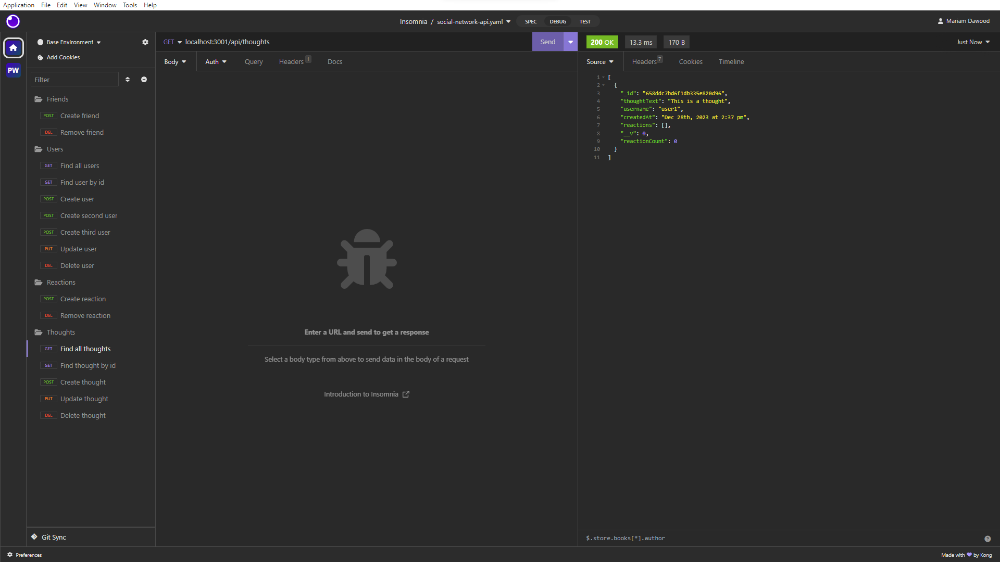

# Social Network API 

## Description
This API is built for a social network web application using Express.js and MongoDB with Mongoose. User can use Insomnia to test APIs to share thoughts, react to friends' thoughts, and manage their friend list. Explore the walkthrough video for a demonstration of the API's functionality.

## Walkthrough Video
[Social Network API](Link)

## Screenshot

## Table of Contents
- [Installation](#installation)
- [Usage](#usage)
- [Test](#test)
- [Contributor Guidelines](#contributor-guidelines)
- [Credits](@credits)
- [License](#license)
- [Questions](#questions)

## Installation
- Clone the repository
- Run 'npm install express@latest mongoose@latest @dotenv@latest' to install dependencies
- Set up your MongoDB connection by creating a '.env' file and add your MongoDB URI.

## Usage
- Run 'npm start' to connect to the server.
- Test APIs in Insomnia.

## Contributor Guidelines

## License

This project is licensed under the [MIT](https://opensource.org/licenses/MIT) license.

## Questions

For any questions or additional information, please contact me:
- [Email](mailto:mariam.miladd@gmail.com?subject=[GitHub]%20Dev%20Connect)
- [GitHub](https://github.com/mariamdawood)